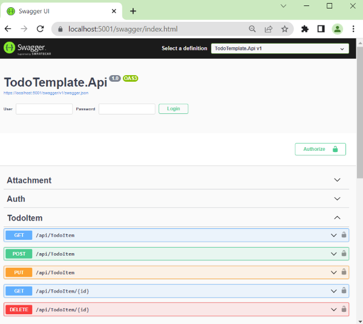
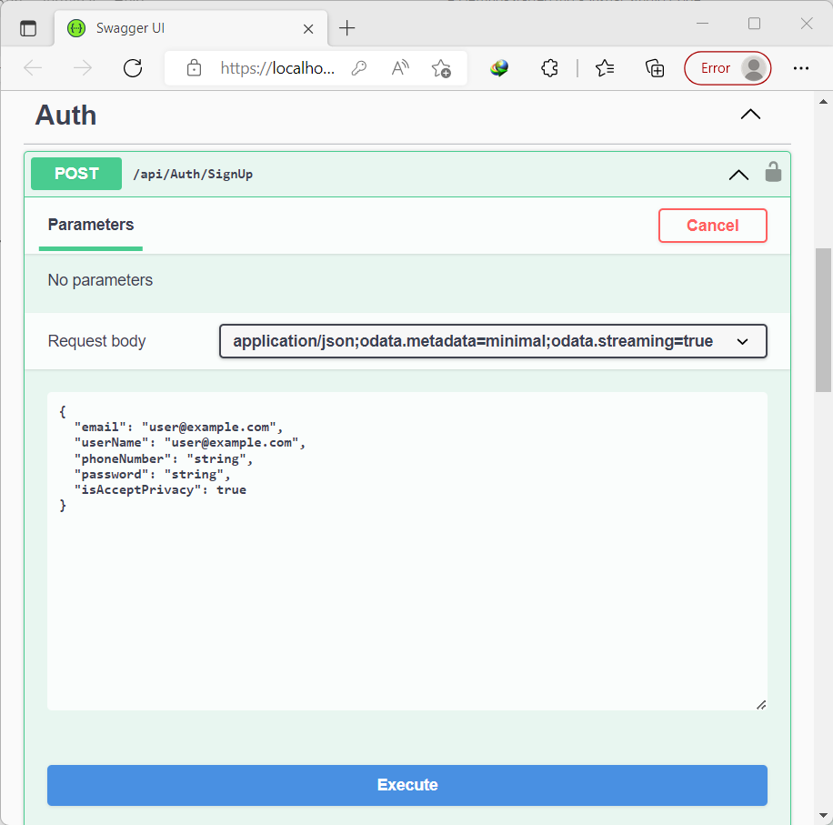
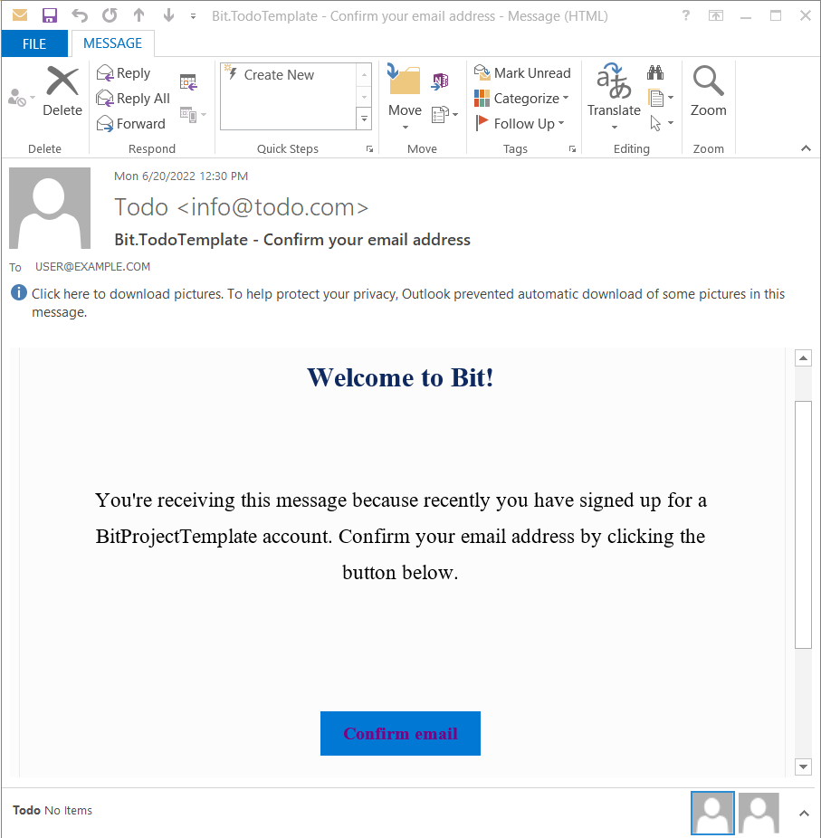
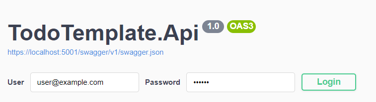
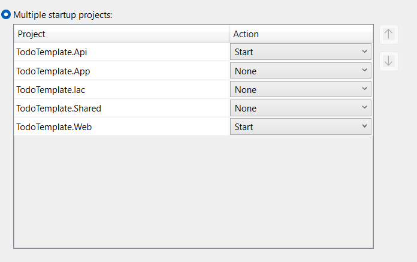
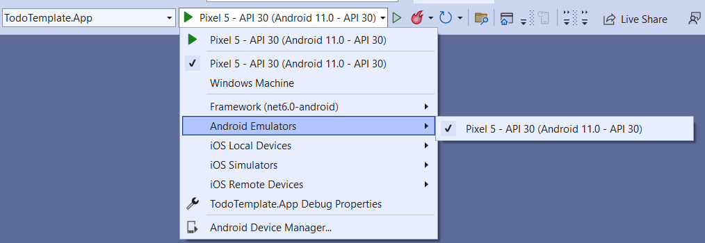
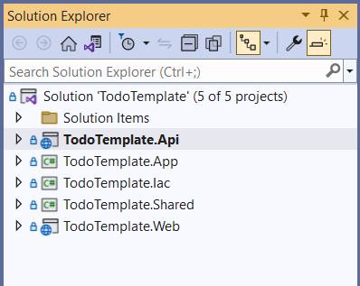

# Getting Started

This document aimed to create and run a Bit-Platform (Bit) project in a short period. It is assumed that you, as the developer, are familiar with the development prerequisites that follow.

## Development prerequisites

- C# as the main development language.
- [Asp.net core blazor](https://docs.microsoft.com/en-us/aspnet/core/blazor/?view=aspnetcore-6.0) as main development Back-End and Front-End framework
- [CSS ](https://www.google.com/url?sa=t&amp;rct=j&amp;q=&amp;esrc=s&amp;source=web&amp;cd=&amp;cad=rja&amp;uact=8&amp;ved=2ahUKEwji-KOu0pj4AhWwm_0HHeZQDzoQFnoECAgQAQ&amp;url=https%3A%2F%2Fwww.w3schools.com%2Fcss%2F&amp;usg=AOvVaw0Xtbw_GBAChsgvZNkPLVGb)&amp; [Sass ](https://www.google.com/url?sa=t&amp;rct=j&amp;q=&amp;esrc=s&amp;source=web&amp;cd=&amp;cad=rja&amp;uact=8&amp;ved=2ahUKEwjvgoO60pj4AhUCi_0HHVmXBMkQFnoECAgQAQ&amp;url=https%3A%2F%2Fsass-lang.com%2F&amp;usg=AOvVaw0p_IRgLEbIPRGWtlW7Wph8)as stylesheet
- [Entity Framework Core](https://docs.microsoft.com/en-us/ef/core/) as ORM to communicate with the database
- [Asp.Net Identity](https://docs.microsoft.com/en-us/aspnet/identity/overview/getting-started/introduction-to-aspnet-identity) with [JWT ](https://www.c-sharpcorner.com/article/jwt-authentication-and-authorization-in-net-6-0-with-identity-framework/)supporting for handling Authentication
- Swagger as OpenId for APi Documentation

## Environment setup

- Microsoft Visual Studio 2022 - Preview Version 17.3.0 Preview or higher with the following workloads and extention
  - Asp.net and web development
  - Net Multi-Platform App UI development
- [Web Compiler 2022+ VisualStudtio extention](https://marketplace.visualstudio.com/items?itemName=Failwyn.WebCompiler64 "Web Compiler 2022+")
- [Microsoft SQL Server Developer edition](https://www.microsoft.com/en-us/sql-server/sql-server-downloads "Sql server") Or change the EntityFramework DBContext database provide to make it work with your preferred database (find it in the Database section)

**Note**: In development, For the app to access the local Api project IP the VisualStudio needs to **Run as Administrator**.
## Create project
Use `dotnet new` approach. bellow command installs the package and then creates a new project from it.

    > dotnet new -i Bit.TodoTemplate
   

# Prepare The Project

## Database

**Connection String**

Open  **appsettings.json** file in  **TodoTemplate.Api**  project and change the  **ConnectionStrings ** connection string if you want:

     "ConnectionStrings": {
        "SqlServerConnectionString": "Data Source=.; Initial Catalog=TodoTemplateDb;Integrated Security=true;Application Name=Todo;"
    },

For Other Entityframework supported databases, you need to configure the context that provides your preferred database. with change `UseSqlServer` method on `Api\Startup\Services.cs` file

        services.AddDbContext<TodoTemplateDbContext>(options =>
        {
            options.UseSqlServer(configuration.GetConnectionString("SqlServerConnectionString"), sqlOpt =>
            {
                sqlOpt.UseQuerySplittingBehavior(QuerySplittingBehavior.SplitQuery);
            });
        });
## Migration

To create and migrate the database to the latest version. You can use Entity Framework's built-in tools for migrations. Open **Package Manager Console** in Visual Studio set **TodoTemplate.Api** as the Default Project and run the Update-Database command as shown below:

    Update-Database -Context TodoTemplateDbContext

# Run
After you've done the configuration, you can run the application.
Set Api project as startup and run, you can see the swagger dashboard in the first view

## SignUp
With the help of **Swagger**, you can call the **SignUp** API and Start the registration process, navigate to `Auth/SignUp` API and press the `Try it Out` button, in the `Request body` Enter SignUp data, and press Execute button.

In **SignUp** Process after call API, a confirmation email send to your email, In the development, Bit saves sent emails as a .eml file in the below path, and developers can easily handle them.

    ./TodoTemplate/Api/bin/Debug/net6.0/sent-emails

By pressing the `Confirm email` button, the ConfirmEmail Api calls and registration process complete.
After it, you can login with the swagger login form on the top of the page, and call other APIs that need Authentication.

## Blazor Mode (hosting models)
Bit use Blazor for building UI, Blazor is a web framework for building web UI components ([Razor components](https://docs.microsoft.com/en-us/aspnet/core/blazor/components/?view=aspnetcore-6.0 "aaa")) that can be hosted in different ways. Razor components can run server-side in ASP.NET Core (Blazor Server) versus client-side in the browser on a [WebAssembly](https://webassembly.org/)-based .NET runtime (Blazor WebAssembly, Blazor WASM). You can also host Razor components in native mobile and desktop apps that render to an embedded Web View control (Blazor Hybrid). Regardless of the hosting model, the way you build Razor components is the same. The same Razor components can be used with any of the hosting models unchanged.

[Read more About ASP.NET Core Blazor hosting models](https://docs.microsoft.com/en-us/aspnet/core/blazor/hosting-models?view=aspnetcore-6.0)

> Bit supports all three modes. It follows
### BlazorServer
With the Blazor Server hosting model, the app is executed on the server from within an ASP.NET Core app. UI updates, event handling, and JavaScript calls are handled over a SignalR connection using the WebSockets protocol. 

- To switch to Blazor server mode, change value of   `<BlazorMode>` on **Directory.build.props** file in **Solution Items** root folder.

      <BlazorMode>BlazorServer</BlazorMode>

- Set solution on  Multi-startup project, by right click on solution name and selecting properties from right-click menu (change the action of Api, Web projects to start)

    

- Make sure the first line in the `TodoTemplate.Web.csproj` file contains the following value.

       <Project Sdk="Microsoft.NET.Sdk.Web">
### BlazorWebAssembly
Blazor WebAssembly (WASM) apps run client-side in the browser on a WebAssembly-based .NET runtime. The Blazor app, its dependencies, and the .NET runtime are downloaded to the browser. The app is executed directly on the browser UI thread. UI updates and event handling occur within the same process. The app's assets are deployed as static files to a web server or service capable of serving static content to clients.

- To switch to Blazor WebAssembly mode, change value of   `<BlazorMode>` on **Directory.build.props** file in **Solution Items** root folder.
 
      <BlazorMode>BlazorWebAssembly</BlazorMode>

- Set **Api** project as startup project
- Make sure the first line in the `TodoTemplate.Web.csproj` file contains the following value.

       <Project Sdk="Microsoft.NET.Sdk.BlazorWebAssembly">

### BlazorHybrid
Blazor can also be used to build native client apps using a hybrid approach. Hybrid apps are native apps that leverage web technologies for their functionality. In a Blazor Hybrid app, Razor components run directly in the native app (not on WebAssembly) along with any other .NET code and render web UI based on HTML and CSS to an embedded Web View control through a local interop channel.

To switch to Blazor Hybrid mode

1. change value of   `<BlazorMode>` on **Directory.build.props** file in **Solution Items** root folder.

        <BlazorMode>BlazorHybrid</BlazorMode>

2. Set `App` project as the startup project, choose either Android, IOS, or Windows, then select your Physical device or Emulator as Debug-Target.

    

3. Set solution on  Multi-startup project, by right click on solution name and selecting properties from right-click menu (change the action of Api, App projects to start)
## WebApp Deployment Type
Supported deployment type are:
### Default Deployment Type
  It's referring to a Typical single page application(SPA) without pre-rendring.

### PWA  
A Blazor WebAssembly app built as a [Progressive Web App](https://en.wikipedia.org/wiki/Progressive_web_application "PWA") (PWA) uses modern browser APIs to enable many of the capabilities of a native client app, such as working offline, running in its own app window, launching from the host's operating system, receiving push notifications, and automatically updating in the background.

**Note**: Asp.net blazor supports **PWA** by default, but its update mechanism is unreliable due PWA nature, **Bit** allows you to handle it When a new version wants to be updated.

### SSR
[Server-side rendering (SSR)](https://www.educative.io/edpresso/what-is-server-side-rendering), is the ability of an application to contribute by displaying the web-page on the server instead of rendering it in the browser. Server-side sends a fully rendered page to the client; Blazor pre-renders page and sends it as a static page, then later the page becomes an interactive Blazor app. This behavior is intended to serve pages quickly to search engines with time-based positioning. 
Statically prerender the component along with a marker to indicate the component should later be rendered interactively by the Blazor app. It improve SEO.

It's referring to a Typical single page application(SPA) with pre-rendring.

### Static
Static Statically render the component with the specified parameters. It's recommended when the target is building a static page like a landing page, content page, And like these.
## How change WebApp Deployment Type easily?
To switch to each mode, easily change value of   `<WebAppDeploymentType>` on **Directory.build.props** file in **Solution Items** root folder.

      <WebAppDeploymentType>DefaultDeploymentType</WebAppDeploymentType>
        <!-- You can choose either Static, DefaultDeploymentType, PWA or SSR -->
## Settings
### Authentication policies
Bit provides authentication with  and implements the SignUp and SignIn user interfaces.
You can change the default settings of the Identity Settings according to your needs;
These settings are in the `appsettings.json` file in the Api project.

     "IdentitySettings": {
                "PasswordRequireDigit": "false",
                "PasswordRequiredLength": "6",
                "PasswordRequireNonAlphanumeric": "false",
                "PasswordRequireUppercase": "false",
                "PasswordRequireLowercase": "false",
                "RequireUniqueEmail": "true",
                "ConfirmationEmailResendDelay": "0.00:02:00", //Format: D.HH:mm:nn
                "ResetPasswordEmailResendDelay": "0.00:02:00" //Format: D.HH:mm:nn
            },  
 
### JWT settings
Bit used JWT to provide token based authentication and you can either change Jwt settings, you can find these settings in the `appsettings.json` file in the Api project.

    "JwtSettings": {
                "IdentityCertificatePassword": "P@ssw0rdP@ssw0rd",
                "Issuer": "TodoTemplate",
                "Audience": "TodoTemplate",
                "NotBeforeMinutes": "0",
                "ExpirationMinutes": "1440"
            },

**Note**: IdentityCertificatePassword referring to the password of the `IdentityCertificate.pfx` file in the Api project that used as certificate file for store the public key and etc for validating incoming JWT tokens. to create PFX file run following commands in PowerShell with desired password and file path for your pfx file

 	> $cert = New-SelfSignedCertificate -CertStoreLocation Cert:\LocalMachine\My -Subject "IdentityServerCN" -Provider "Microsoft Strong Cryptographic Provider" -HashAlgorithm "SHA512" -NotAfter (Get-Date).AddYears(5)
    > Export-PfxCertificate -cert ('Cert:\LocalMachine\My\' + $cert.thumbprint) -FilePath PATH_TO_YOUR_IdentityServerCertificate.pfx -Password (ConvertTo-SecureString -String "YOUR_PASSWORD" -Force -AsPlainText)

### Email Settings
Bit used [FluentEmail](https://github.com/lukencode/FluentEmail) to send emails whenever needs.
for example in SignUp, you can either change the SMTP provide settings as you need, you can find these settings in the `appsettings.json` file in the Api project.

    "EmailSettings": {
                "Host": "LocalFolder", // Local folder means storing emails in bin\sent-emails folder. (Recommended for testing purposes only)
                "Port": "25",
                "DefaulFromEmail": "info@todo.com",
                "DefaultFromName": "Todo",
                "UserName": null,
                "Password": null
            },

**Note**: You can find email templates used for email confirmation and reset password in the `Resources` directory of the Api project

## User Profile image setting
Bit save user profile image in `Attachments\Profiles` directory of the Api project as default, you can change this path as you need from the `appsettings.json` file in the Api project.

    "UserProfileImagePath": "./Attachments/Profiles/"

### Health Check Settings
Bit support Health Checks for reporting the health of app infrastructure components.
Health checks are exposed by an app as HTTP endpoints. If you need to enable or disable this functionality you can find these settings in the `appsettings.json` file in the Api project.

    "HealCheckSettings": {
                "EnableHealthChecks": true
            },

**Note**: You can find Health Checks dashboard from route `https://localhost:5001/healthchecks-ui` as default.

## TodoTemplate Project structure
The **TodoTemplate** solution prepared with Bit has 5 Projects.

- **TodoTemplate.Api**:
This project contains server-side codes including Controllers, Data access layer (EntityFramework ORM), Identity, etc.

- **TodoTemplate.App**: 
This project contains code related to building an app, although much of the code is common to the web project and refers to it.
- **TodoTemplate.Iac**: 
Infrastructure as Code (IaC) is the managing and provisioning of infrastructure through code instead of through manual processes. This project contains the necessary code to provide this feature.
- **TodoTemplate.Shared**: This project is shared on both the server (Api project) and client(Web, App projects) sides, and can share code. The bit puts the code it wants to reuse; Like resources, Dtos, shared contracts, services, etc.

    **Note**: Be careful about what you put in the shared projects because they will available on both sides.
- **TodoTemplate.Web**: This project contains the necessary code to build the project UI, whether it is a web output or an application. And includes components and pages made with the help of Razor and Style sheet

## Exception handling
Bit performs some features to manage exceptions that occurred in runtime. 
### Server-Side exception handling
- **known and unknown exception**: In development When an error occurred if this error is known or unknown, details of the error returned, but in test and production for unknown error details of the error not returned from server.
  - known exception inhrites `KnownException` class
  - Unknown exception inhrites `UnknownException` class
- **RestException**: It's a class that has an HTTP Response `StatusCode` that you to perform a response with status code.

### Client side exception handling
When an error is raised in App(android, IOS) maybe cause crash app. for avoiding app crash; Bit provides some mechanism for error handling.
- inheriting `TodoTemplateComponentBase` in razor pages.
- Instead of initializing your components in the `OnInitializedAsync` method, override the `OnInitAsync` method of the `TodoTemplateComponentBase` class.
- Use `WrapHandle` method instead of direct calling events such as `OnClick` in the Razor components.
- Use `try-catch` block in `asyn-avoid` method and call `StatehasChanged` method to handle unexpected errors.

## Community
This is an open source project and open to contributions from the community.
- Use the GitHub repository to access the latest source code, create issues and send pull requests.
- Use bitplatform tag on stackoverflow to ask questions about the usage.
- Give us a try and use our nuget packages in your apps!
- Code review

