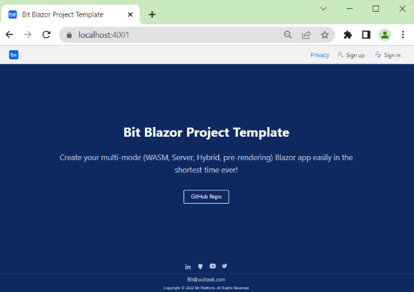
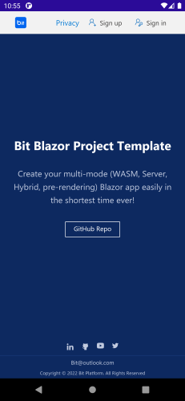

# Getting Started

This document aimed to create and run a Bit-Platform (Bit) project in a short period. It is assumed that you, as the developer, are familiar with the development prerequisites that follow.

## Development prerequisites

- C# as the main development language.
- [Asp.net core blazor](https://docs.microsoft.com/en-us/aspnet/core/blazor/?view=aspnetcore-6.0) as main development Back-End and Fron-End framework
- [CSS ](https://www.google.com/url?sa=t&amp;rct=j&amp;q=&amp;esrc=s&amp;source=web&amp;cd=&amp;cad=rja&amp;uact=8&amp;ved=2ahUKEwji-KOu0pj4AhWwm_0HHeZQDzoQFnoECAgQAQ&amp;url=https%3A%2F%2Fwww.w3schools.com%2Fcss%2F&amp;usg=AOvVaw0Xtbw_GBAChsgvZNkPLVGb)&amp; [Sass ](https://www.google.com/url?sa=t&amp;rct=j&amp;q=&amp;esrc=s&amp;source=web&amp;cd=&amp;cad=rja&amp;uact=8&amp;ved=2ahUKEwjvgoO60pj4AhUCi_0HHVmXBMkQFnoECAgQAQ&amp;url=https%3A%2F%2Fsass-lang.com%2F&amp;usg=AOvVaw0p_IRgLEbIPRGWtlW7Wph8)as stylesheet
- [Entity Framework Core](https://docs.microsoft.com/en-us/ef/core/) as ORM to communicate with the database
- [Asp.Net Identity](https://docs.microsoft.com/en-us/aspnet/identity/overview/getting-started/introduction-to-aspnet-identity) with [JWT ](https://www.c-sharpcorner.com/article/jwt-authentication-and-authorization-in-net-6-0-with-identity-framework/)supporting for handling Authentication
## Environment setup

- Microsoft Visual Studio 2022 - Preview Version 17.3.0 Preview 1.0 or higher with the following workloads and extention
- 1. Asp.net and web development
- 2. Net Multi-Platform App UI development
- 3. [Web Compiler 2022+ VisualStudtio extention](https://marketplace.visualstudio.com/items?itemName=Failwyn.WebCompiler64 "Web Compiler 2022+")

## Create project
Use `dotnet new` approach based on assumption that we've Bit.Tooling.Templates.TodoTemplate nuget package. bellow command installs the package and then creates a new project from it.

    > dotnet new -i Bit.Tooling.Templates.TodoTemplate
   

# Configure The Project

## Database

**Connection String**

Open  **appsettings.json** file in  **TodoTemplate.Api**  project and change the  **SqlServerConnection ** connection string if you want:

    "SqlServerConnection": {
            "SqlServerConnection": "Data Source=.; Initial Catalog=TodoTemplateDb;Integrated Security=true"
        }

## Migration

To create and migrate the database to the latest version. You can use Entity Framework's built-in tools for migrations. Open **Package Manager Console** in Visual Studio set **TodoTemplate.Api** as the Default Project and run the Update-Database command as shown below:

    Update-Database -Context TodoTemplateDbContext

# Run
## Blazor Mode (hosting models)
Bit use Blazor for building UI, Blazor is a web framework for building web UI components ([Razor components](https://docs.microsoft.com/en-us/aspnet/core/blazor/components/?view=aspnetcore-6.0 "aaa")) that can be hosted in different ways. Razor components can run server-side in ASP.NET Core (Blazor Server) versus client-side in the browser on a [WebAssembly](https://webassembly.org/)-based .NET runtime (Blazor WebAssembly, Blazor WASM). You can also host Razor components in native mobile and desktop apps that render to an embedded Web View control (Blazor Hybrid). Regardless of the hosting model, the way you build Razor components is the same. The same Razor components can be used with any of the hosting models unchanged.

[Read more About ASP.NET Core Blazor hosting models](https://docs.microsoft.com/en-us/aspnet/core/blazor/hosting-models?view=aspnetcore-6.0)

> Bit supports all three modes. It follows
### BlazorServer
With the Blazor Server hosting model, the app is executed on the server from within an ASP.NET Core app. UI updates, event handling, and JavaScript calls are handled over a SignalR connection using the WebSockets protocol. 

### BlazorWebAssembly
Blazor WebAssembly (WASM) apps run client-side in the browser on a WebAssembly-based .NET runtime. The Blazor app, its dependencies, and the .NET runtime are downloaded to the browser. The app is executed directly on the browser UI thread. UI updates and event handling occur within the same process. The app's assets are deployed as static files to a web server or service capable of serving static content to clients.

### BlazorHybrid
Blazor can also be used to build native client apps using a hybrid approach. Hybrid apps are native apps that leverage web technologies for their functionality. In a Blazor Hybrid app, Razor components run directly in the native app (not on WebAssembly) along with any other .NET code and render web UI based on HTML and CSS to an embedded Web View control through a local interop channel.

**Note**: In development, For the app to access the local Api project IP the VisualStudio needs to **run as Admin** and use `*`  instead of localhost in the IP server.

## How change BlazorMode easily?
To switch to each mode, easily change value of   `<BlazorMode>` on **Directory.build.props** file in **Solution Items** root folder.

      <BlazorMode>BlazorServer</BlazorMode>
       <!-- You can use either BlazorServer or BlazorWebAssembly or BlazorHybrid -->

**Note**: for **BlazorServer** mode you need multi startup for both api & web projects.

**Note**: for **blazorWebAssembly** mode only set as startup Api project and run it.

**Note**: for **BlazorHybrid** mode you need multi startup for both api & app projects.
## WebApp Deployment Type
Bit Supports several modes for WebApp deployment. This concept is related to performance. The fastest way to serve a page is to render page statically then send, and, the slowest way to serve a page is to serve an "interactive Blazor" server page (with a live virtual DOM synchronized via SignalR websockets). 

### Default Deployment Type
  It's referring to a Typical single page application(SPA)

### Static
Static Statically render the component with the specified parameters. Like MVC, it's recommended when the target is building a static page like a landing page And like these.
### PWA  
A Blazor WebAssembly app built as a [Progressive Web App](https://en.wikipedia.org/wiki/Progressive_web_application "PWA") (PWA) uses modern browser APIs to enable many of the capabilities of a native client app, such as working offline, running in its own app window, launching from the host's operating system, receiving push notifications, and automatically updating in the background.

**Note**: Asp.net blazor supports PWA by default, but Bit fixes some of its disadvantages and provides a better PWA experience. 
### SSR
[Server-side rendering (SSR)](https://www.educative.io/edpresso/what-is-server-side-rendering), is the ability of an application to contribute by displaying the web-page on the server instead of rendering it in the browser. Server-side sends a fully rendered page to the client; Blazor pre-renders page and sends it as a static page, then later the page becomes an interactive Blazor server app. This behavior is intended to serve pages quickly to search engines with time-based positioning. 
Statically prerender the component along with a marker to indicate the component should later be rendered interactively by the Blazor Server app. It's optimize SEO of site

## How change WebApp Deployment Type easily?
To switch to each mode, easily change value of   `<WebAppDeploymentType>` on **Directory.build.props** file in **Solution Items** root folder.

      <WebAppDeploymentType>DefaultDeploymentType</WebAppDeploymentType>
        <!-- You can choose either Static, DefaultDeploymentType, PWA or SSR -->

## Run API Host
Once you've done the configuration, you can run the application. If you set Api project as startup and run you can see the swagger dashboard in the first view

## Run Web app (in BlazorServer mode)
To run the Web app you need to run both the Api project and The Web project, Run these two projects as multiple startup.

## Run App (in BlazorHybrid mode)
To run the Web app you need to run both the Api project and The App project, Run these two projects as multiple startup.

## Settings
### Authentication policies
Bit provides authentication with  and implements the SignUp and SignIn user interfaces.
You can change the default settings of the Identity Settings according to your needs;
These settings are in the `appsettings.json` file in the Api project.

     "IdentitySettings": {
                "PasswordRequireDigit": "false",
                "PasswordRequiredLength": "6",
                "PasswordRequireNonAlphanumeric": "false",
                "PasswordRequireUppercase": "false",
                "PasswordRequireLowercase": "false",
                "RequireUniqueEmail": "true",
                "ConfirmationEmailResendDelay": "0.00:02:00", //Format: D.HH:mm:nn
                "ResetPasswordEmailResendDelay": "0.00:02:00" //Format: D.HH:mm:nn
            },  
 
### JWT settings
Bit used JWT to provide token based authentication and you can either change Jwt settings, you can find these settings in the `appsettings.json` file in the Api project.

    "JwtSettings": {
                "IdentityCertificatePassword": "P@ssw0rdP@ssw0rd",
                "Issuer": "TodoTemplate",
                "Audience": "TodoTemplate",
                "NotBeforeMinutes": "0",
                "ExpirationMinutes": "1440"
            },

**Note**: IdentityCertificatePassword referring to the password of the `IdentityCertificate.pfx` file in the Api project that used as certificate file for store the public key and etc for validating incoming JWT tokens.

### Email Settings
Bit used [FluentEmail](https://github.com/lukencode/FluentEmail) to send emails whenever needs.
for example in SignUp, you can either change the SMTP provide settings as you need, you can find these settings in the `appsettings.json` file in the Api project.

    "EmailSettings": {
                "Host": "LocalFolder", // Local folder means storing emails in bin\sent-emails folder. (Recommended for testing purposes only)
                "Port": "25",
                "DefaulFromEmail": "info@todo.com",
                "DefaultFromName": "Todo",
                "UserName": null,
                "Password": null
            },

**Note**: In the development process, Bit saves sent emails as a .eml file in the below path, and developers can easily handle them.

    ./TodoTemplate/Api/bin/Debug/net6.0/sent-emails./TodoTemplate/Api/bin/Debug/net6.0/sent-emails

### HealCheck Settings
Bit support Health Checks for reporting the health of app infrastructure components.
Health checks are exposed by an app as HTTP endpoints. If you need to enable or disable this functionality you can find these settings in the `appsettings.json` file in the Api project.

    "HealCheckSettings": {
                "EnableHealthChecks": true
            },

**Note**: You can find Health Checks dashboard from route `https://localhost:5001/healthz` as default.
## Additional tips
- use the `Clean.bat` file in the root of the solution directory to deep clean the projects and run without unexpected exceptions. 
- handle the error with ..

## Useful links
1. [FAQ](FAQ.md)
2. [How debugging](Debugging.md)
3. [Infrastructure as Code (IaC)](Infrastructure-As-Code.md)
4. [How publish](Publish.md)
5. [Error handling](Error-Handling.md) 

